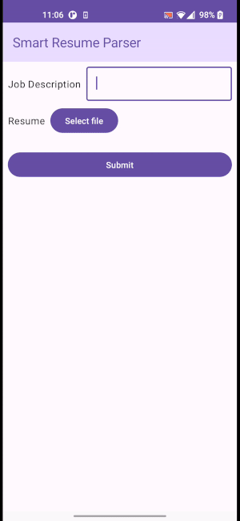

# Resume Parser Android App using Gemini Pro

The Resume Parser App is an Android application built with Jetpack Compose that utilizes Gemini Pro to parse resumes based on the job description and selected file.

## Features

- **Job Description Matching**: Match the parsed resume with a provided job description to evaluate suitability.
- **Resume Parsing**: Upload a resume file and parse it to extract relevant information

## Technology

- **Jetpack Compose**: Modern UI toolkit for building native Android UIs with Kotlin.

## Getting Started

### Prerequisites

- Android Studio Arctic Fox (2020.3.1) or newer.
- Android SDK 24 or later.

### Installation

1. Clone the repository:

    ```
    git clone https://github.com/bhoomigadhiya/GeminiPro_ResumeParser/.git
    ```

2. Navigate to the project directory:

   ```
   cd GeminiPro_ResumeParser/Android/SmartResumeParser
   ```

3. Open the project in Android Studio.

4. Build and run the project on an emulator or physical device.

## Usage
1. **Enter Job Description**: Enter the job description into the provided text field.
2. **Select Resume**: Click on the "Select File" button to choose a resume file from your device.
3. **Parse Resume**: Click on the "Submit" button to parse the selected resume.
4. **Get the Result**:  Get the resume evaluation.

## Demo



## Download APK

You can download the latest APK [here](SmartResumeParser/SmartResumeParser.apk).

## Developer

[Bhoomi Gadhiya](https://www.linkedin.com/in/bhoomigadhiya/)